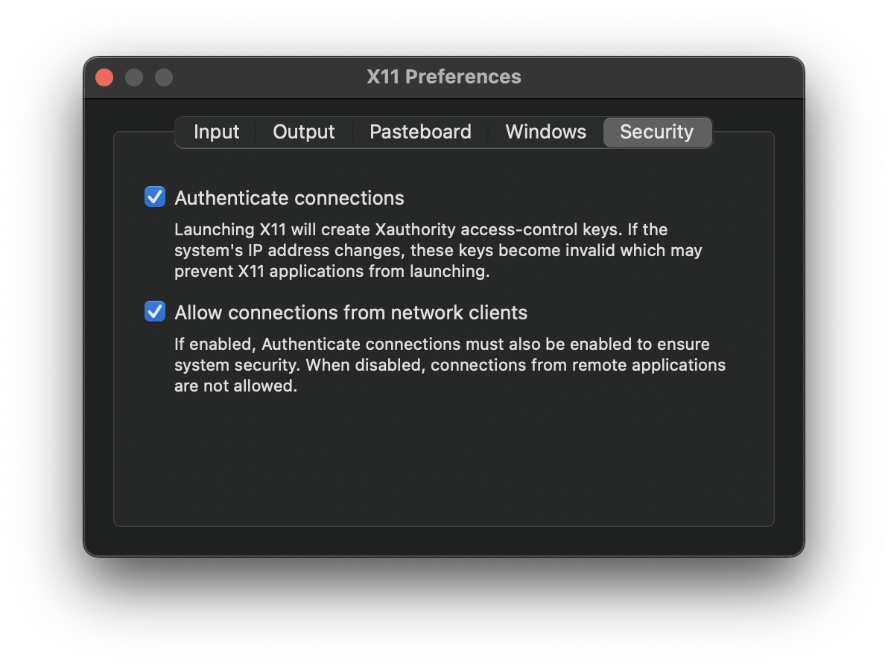

# Badger Hands-on Session

Welcome to the Badger hands-on sessions! Please read through the [prerequisites](#prerequisites) section before the hands-on session to get ready for it :)

## Prerequisites

Please do these before the hands-on session, since the setup could take tens of minutes or even longer, based on your network condition. Thank you!

### 0. Clone the repo

Run the following command in terminal:

```
git clone https://github.com/SLAC-ML/Badger-Handson.git
```

Then `cd` to the root of the cloned repo:

```
cd Badger-Handson
```

### 1. Setup a Badger environment

Badger and its plugins are python-based packages/scripts, so a proper python environment is needed. The easiest way to play with Badger w/o messing w/ your system is through [docker](https://www.docker.com/). If you feel confident and would like to install Badger directly on your system, [conda](https://docs.conda.io/en/latest/) would be a good choice. Please choose one of the two paths below to get Badger installed on your computer.

#### Install Badger with docker

1. [Install docker](https://docs.docker.com/get-docker/) if you haven't done so already. You can follow the tutorial showed up when you launch docker for the first time to get a feeling of what docker is about
2. Pull the pre-configured Badger docker image into your computer:

    ```
    docker pull slacml/badger-handson
    ```

    The docker image is around 2.5GB so it would take some time to get downloaded. When the pulling is done, run `docker images` to make sure the image is listed there
3. [Install XQuartz](https://www.xquartz.org/) if you are using a mac. In order to expose the GUI from within the Badger docker images, we need to forward the GUI to an X window system, which is provided by XQuartz

After the installation, for the mac users, you'll need to check the `Allow connections from network clients` option under the `Security` tab of the XQuartz preference, as shown below:



If you choose to go with the docker option, a set of bash scripts are provided to make life easier:

- Run Badger in docker:

    ```
    ./run.sh
    ```

- Use Badger in docker again after quit the container:

    ```
    ./resume.sh
    ```

- Run Badger in docker and delete the container when quit:

    ```
    ./run_once.sh
    ```

    Note that Badger that launched by `run_once.sh` cannot be resumed after quit!

- Remove the Badger docker container and reset other system settings:

    ```
    ./clean_up.sh
    ```

#### Install Badger with conda

1. [Install conda](https://docs.conda.io/projects/conda/en/latest/user-guide/install/index.html#regular-installation) if you haven't done so already
2. List all conda environments on your computer:

    ```
    conda env list
    ```

    and make sure you don't have an environment named `badger`. Then create the badger conda environment with the given yaml env file:

    ```
    conda env create -f environment.yml
    ```

    It would take some time (~30min) since there are some bulky packages to be resolved/installed in the predefined conda env

## Beginner's Tasks

These [slides](https://docs.google.com/presentation/d/1vIbZp_Gyw0IjGwkqmY4oChuS0R-5dBAAVQt0hAsQGes/edit?usp=sharing) contain some cheat sheets and solutions to the following tasks, so please give it a look when you get stuck!

### 0. Configure Badger

Tell Badger where to find:

- [ ] Plugins
- [ ] Database (routines)
- [ ] Logbook
- [ ] Archived runs

### 1. Hello world

This task should be done w/ Badger CLI.

- [ ] Investigate `silly` algo to see the hyperparameters
- [ ] Investigate `silly` env to see the available variables/observations
- [ ] Use `silly` algorithm to optimize `silly` environment with the routine config given in `tasks/01/config.yaml`
- [ ] Modify `tasks/01/config.yaml` to limit the viable range of `q1` to `[0.4, 0.6]`, run and save the routine as `helloworld`
- [ ] Rerun the `helloworld` routine you just saved

### 2. Constrainted optimization

This task should be done w/ Badger GUI.

- [ ] Launch the Badger GUI
- [ ] Load the `helloworld` routine
- [ ] Add `l1` as a constraint, set the rule:

    ```
    l1 < 0.5
    ```

    And make it a hard constraint, run the optimization, keep going until alert being triggered 3 times

### 3. Add extra variables on the fly

This task should be done w/ Badger GUI.

- [ ] Load the `helloworld` routine
- [ ] Set all available `silly` environment variables (`q1`, `q2`, `q3`, `q4`) to be optimization variables
- [ ] Try to also add `q5`, `q7`, and `q9` as optimization variables, run the optimization

### 4. Let's do some real thing

This task should be done w/ Badger GUI.

- [ ] Create a new routine with `simplex` algorithm and `inj_surrogate` environment
- [ ] Set optimization variables to be:

    - `SOL1:solenoid_field_scale`
    - `CQ01:b1_gradient`
    - `SQ01:b1_gradient`

    And optimization objective to be:

    - Minimize `norm_emit`

    We'll refer to this routine config lately as `routine config X`
- [ ] Use the default params of `simplex` algo, run the routine, save the optimal to logbook
- [ ] Set the `start_from_current` hyperparameter of `simplex` algo to `false`, run the routine
- [ ] Tune the `x0` hyperparameter (the initial solution) to make the routine work, save the optimal to logbook, reset the environment
- [ ] Close and relaunch Badger GUI, figure out a way to add a hard constraint:

    ```
    sigma_x < 0.15
    ```

    to `routine config X`, **WITHOUT configuring everything from the beginning** (note that we didn't save the routine)
- [ ] Switch the algorithm to `basic_bo`, run the optimization again, save the optimal to logbook, reset the environment
- [ ] Delete all the failed runs in this task

### 5*. Add noise to the `norm_emit` observation

- [ ] Read code of the `_get_obs` function in `plugins/environments/inj_surrogate/__init__.py`
- [ ] Add a Gaussian noise ~ `N(0, 0.01)` to the `norm_emit` observation. To generate a Gaussian noise ~ `N(mu, sigma^2)`, in Python one could:

    ```python
    import numpy as np


    noise = sigma * np.random.randn() + mu
    ```

### 6*. Create a constant optimizer (noise meter)!

- [ ] Based on `silly` algorithm plugin, create a `const` algorithm plugin that repeatly evaluates the initial solution for a given times
- [ ] Use your `const` algorithm to optimize `routine config X`
- [ ] Change the objective in `routine config X` to `norm_emit_x`, use your `const` algorithm to optimize the modified problem

---

Questions? Contact us on [slack](https://join.slack.com/share/enQtMzE2MjQ2OTI5MzY5OC00NzdkODkxY2NjN2IzYjIxOTBiMTBkMTQwMTVhYTYxOTc2NWEyYjczYTI2YjNkZjk4MzgzM2EyODJjNGY1YzE1), [email](mailto:zhezhang@slac.stanford.edu)
